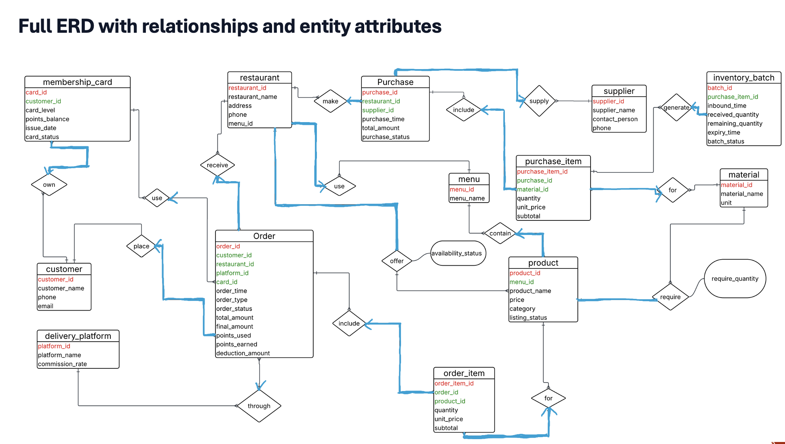

# Restaurant Management System

This project is a restaurant management system for chain restaurants. It covers menu management, inventory, procurement, orders, delivery, and membership points. Its main focus is on database-centered design, using PostgreSQL constraints, triggers, and stored procedures to automate core business logic.

To make the system easier to use and demonstrate, Node.js and Express were later used to build a web-based frontend interface for interacting with the database.

This system supports the full workflow of a restaurant chain:

- shared menu across branches
- branch-level product availability
- procurement and batch-based inventory management
- dine-in, takeout, and delivery orders
- membership cards and loyalty points
- trigger-driven automation inside PostgreSQL

The main goal of the project is to show how important business rules can be enforced **inside the database layer**, not only in application code.

---

## 1. Important Files

Before running the system, please note the role of the following files:

- `db_with_data.sql`: full PostgreSQL dump with schema, triggers, procedures, and sample data. This is the recommended file for reproducing the complete project.
- `schema_final.sql`: schema-only version, useful if you want the database structure without sample data.
- `db.js`: database connection configuration file. Please update the PostgreSQL username and password before starting the application.

For most users, the easiest way to run the project is to import `db_with_data.sql`.

---

## 2. Tech Stack

| Layer | Technology |
|---|---|
| Database | PostgreSQL 15 |
| Backend | Node.js + Express.js |
| Frontend templating | EJS |
| DB Driver | node-postgres (`pg`) |
| Styling | CSS |
| Tools | pgAdmin 4, Git |

---

## 3. How the System Works

A customer first selects a restaurant branch and views the available products in the system. Although all branches share the same menu, the actual availability of products depends on the inventory of each branch. After the customer chooses products, the application creates an order in the database with an initial status.

The order may be a dine-in, takeout, or delivery order. If it is a delivery order, the database requires a valid delivery platform. If the customer uses a membership card, the related point deduction and point earning information is also recorded during order creation.

Once the order is confirmed, the database automatically deducts the required materials from inventory batches. This deduction is performed batch by batch using FIFO logic, based on expiry time first and inbound time second. After inventory changes, the system automatically refreshes batch status and updates branch-level product availability.

Restaurant staff can use the application to manage products, suppliers, materials, purchases, inventory batches, customers, and orders. They can also update order statuses through different stages such as pending, confirmed, preparing, ready, completed, and cancelled.

Finally, when an order reaches completed status, the database automatically updates the membership card balance. In this way, the system keeps menu management, inventory, order processing, delivery validation, and loyalty updates consistent inside the database layer.

### ER Diagram

<p align="center">
  
</p>

---

## 4. Main Database Features

- **15 tables** covering restaurant, menu, products, procurement, inventory, orders, delivery, customers, and membership
- **Relationship tables** such as `Offers` and `Product_Material`
- **CHECK constraints** for status fields and order types
- **Foreign keys** for referential integrity
- **Stored procedure** `sp_place_order(...)` for order creation
- **Trigger chain** for:
  - delivery validation
  - FIFO inventory deduction
  - batch status refresh
  - branch-level offer refresh
  - membership point update

---

## 5. Database Design Summary

### Core design decisions

#### Shared menu, branch-specific availability
All branches share the same `Menu`, but product availability is stored in `Offers(restaurant_id, product_id, availability_status)`.

This separates:
- global menu definition
- branch-level sellability

#### Batch-based inventory
Stock is not stored directly on `Material`.

Instead, inventory is represented through `Inventory_Batch`, which stores:
- `inbound_time`
- `remaining_quantity`
- `expiry_time`
- `batch_status`

This supports:
- FIFO deduction
- expiry-aware stock consumption
- automatic batch status updates

#### Recipe-based material consumption
`Product_Material(product_id, material_id, required_quantity)` records how much of each material is needed for each product.

This allows the database to deduct ingredients automatically when an order is confirmed.

---

## 6. Trigger and Procedure Logic

### Stored procedure
- `sp_place_order(...)`
  - creates an order
  - inserts order items
  - computes `total_amount`, `deduction_amount`, `final_amount`, and `points_earned`

### Triggers
- `trg_delivery_needs_platform`
  - blocks delivery orders without a `platform_id`

- `trg_deduct_inventory`
  - runs when an order changes from `pending` to `confirmed`
  - deducts inventory from `Inventory_Batch` using FIFO logic

- `trg_auto_batch_status`
  - refreshes batch status based on quantity and expiry
  - statuses include `available`, `near_expiry`, `pending_disposal`, and `depleted`

- `trg_offers_on_order`
- `trg_offers_on_batch`
  - recompute branch-level product availability in `Offers`

- `trg_points_on_complete`
  - updates membership card points when an order reaches `completed`

---

## 7. Prerequisites

Please install the following before running the system:

- PostgreSQL 15
- Node.js 18+
- pgAdmin 4 (optional, but useful for database inspection)

---

## 8. How to Run the System

### Step 1: Clone the repository

```bash
git clone https://github.com/wzsyrrr/restaurant-management-system.git
cd restaurant-management-system
```

### Step 2: Create the database

```bash
psql -U postgres -c "CREATE DATABASE restaurant_management;"
```

### Step 3: Import the database

Use **only one** of the following options:

#### Option A: Import the full database (recommended)
This includes both schema and sample data.

```bash
psql -U postgres -d restaurant_management -f db_with_data.sql
```

#### Option B: Import schema only
If you only want the structure without data:

```bash
psql -U postgres -d restaurant_management -f schema_final.sql
```

### Step 4: Configure database connection

Open `db.js` and update the connection settings:

```js
const pool = new Pool({
  host: 'localhost',
  port: 5432,
  database: 'restaurant_management',
  user: 'postgres',
  password: 'YOUR_POSTGRES_PASSWORD'
});
```

### Step 5: Install dependencies

```bash
npm install
```

### Step 6: Start the application

```bash
node index.js
```

Then open:

```text
http://localhost:3000
```

---

## 9. Application Pages

| Page | URL | Purpose |
|---|---|---|
| Dashboard | `/` | View summary counts |
| Products | `/products` | Add, edit, list, and unlist products |
| Inventory | `/inventory` | View stock levels and batch status |
| Purchases | `/inventory/purchases` | Create purchase orders |
| Batches | `/inventory/batches` | Inspect and manage inventory batches |
| Orders | `/orders` | Place and update orders |
| Customers | `/customers` | Manage customers and membership cards |
| Suppliers | `/suppliers` | Manage suppliers |
| Materials | `/materials` | Manage raw materials |